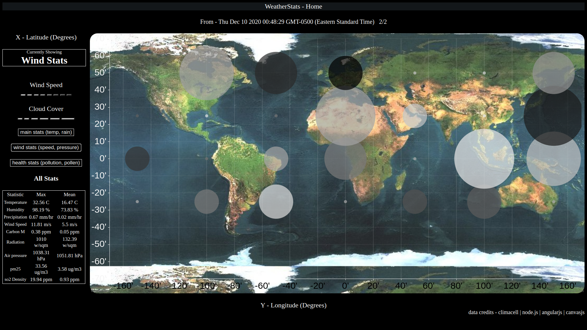

# WeatherStats-MEAN  
The project tracks realtime data of weather and pollution stats from all around the globe every hour.  
It visualizes the weather situations around the globe, emphasizing on colors and sizes to express detailed comparison.  
Each graph is subcategorized by general, wind and pollution related data.   
The mean and max stats from all the data points are shown for each hour.
Users can switch context between categories.  
Data is archived from hour to hour, and the user can request for different times, for each category.  

## Running  
Clone this repository  
cd to this folder  
`node main.js`

## Technologies Used
Data Source - ClimaCell API  
Data Communication - REST API for Archive List (/get_data) and Accurate Data (/get_data_on?date=__)  
Server - NodeJS  
Website - AngularJS | HTML | CSS | CanvasJS  
Data Archive - NoSQL  

## Screenshot

